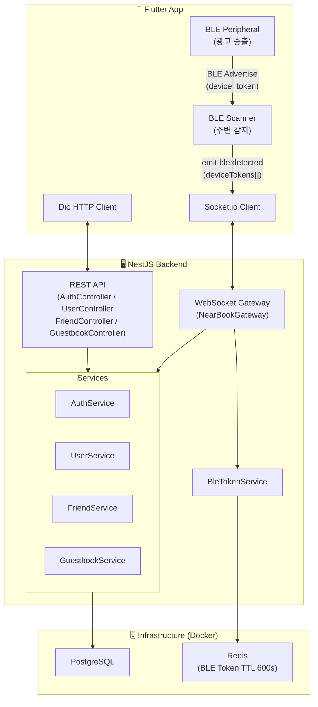

# 📖 NearBook

> BLE 기반 근접 감지로 실제 만남을 기록하는 모바일 방명록 서비스

NearBook은 BLE(Bluetooth Low Energy)를 이용해 주변 친구를 감지하고,
친구에게 방명록 작성을 요청할 수 있는 모바일 애플리케이션입니다.

기존 SNS처럼 언제든 상호작용할 수 있는 구조가 아니라,
실제로 같은 공간에 있는 경우에만 방명록을 남길 수 있도록 설계했습니다.

방명록 요청, 작성 상태 공유, 작성 완료 알림은 WebSocket으로 실시간 처리하며,
사용자 식별은 Redis TTL 기반 Device Token을 활용해 개인정보 노출을 최소화했습니다.
 

**Frontend Repository**: https://github.com/kkimhaji/nearbook-frontend

 

## Problem & Motivation

- 오프라인 방명록 문화에서 착안하여 실제 만남 기반 상호작용을 디지털 방식으로 확장하고자 기획
- 기존 SNS·메신저와 달리, 물리적으로 가까운 상황에서만 상호작용이 가능하도록 제한하여 방명록 작성 경험의 의미와 희소성 유지
- 수동적인 친구 추가 과정 없이 주변 사용자를 자동 인식할 수 있도록 BLE 기반 근접 감지 구조 적용
- 실제 만남의 순간을 기록하는 인터랙션 경험 제공 목적

 

## Screenshots
친구 감지 → 방명록 요청 → 작성 → 공개 → 열람

### 1. 주변 사용자 감지

BLE를 통해 주변 사용자를 탐지
친구 여부에 따라 친구 요청 또는 방명록 요청 가능
BLE 공개 설정에 맞춰 친구에게만 공개할지 모두에게 공개할지 선택 가능

### 2. 방명록 작성

요청받은 사용자가 방명록을 작성

### 3. 방명록 목록

주고받은 방명록을 확인 가능

### 4. 공개 방명록

친구가 공개한 방명록을 열람 가능 (친구 공개)

### 5. 마이페이지

BLE 공개 범위, 방명록 공개 범위, QR 친구 추가 기능 제공

 

## Features

- **BLE 근접 감지** — 앱 포그라운드 상태에서 주변 사용자 자동 감지 (device_token 기반, user_id 직접 노출 없음)
- **방명록 시스템** — 친구에게 방명록 요청 → 작성 → 제출 플로우
- **공개 방명록** — 공개 설정된 방명록을 친구들이 열람 가능
- **실시간 알림** — WebSocket(Socket.io)을 통한 방명록 요청/완료/거절 알림, 타이핑 인디케이터
- **친구 시스템** — 양방향 친구 수락 방식, 아이디 검색으로 친구 추가
- **프라이버시 설정** — `public` / `friends_only` / `hidden` BLE 가시성 설정

 

## Key Design Points

- BLE Device Token 기반 사용자 식별
- WebSocket 기반 실시간 상호작용
- Redis TTL 기반 상태 관리
- 만료 시간 기반 요청 처리
- Socket.io + Redis Adapter 기반 확장 가능한 실시간 구조

 

## Tech Stack

### Backend
- NestJS
- TypeScript
- Socket.io

### Database & Cache
- PostgreSQL
- Redis
- Prisma

### Mobile
- Flutter
- Dart

### Infrastructure
- Docker
 
 

---

## System Architecture

 

## Database Schema

NearBook의 데이터베이스는 사용자, 친구 관계, 방명록 요청, 방명록 데이터를 중심으로 구성되어 있습니다.

* **users**
  사용자 계정 정보를 관리합니다. BLE 공개 범위(`ble_visibility`)와 방명록 공개 범위(`guestbook_visibility`)를 개별 설정할 수 있습니다.

* **friendships**
  친구 요청 및 수락 상태를 관리합니다. `(requester_id, receiver_id)` 조합은 유일하게 유지하여 중복 친구 요청을 방지합니다.

* **guestbook_requests**
  방명록 작성 요청 정보를 관리합니다. `pending → writing → completed / rejected` 상태 흐름을 가지며, `expires_at`을 통해 요청 만료 시간을 관리합니다.

* **guestbook_entries**
  실제 작성된 방명록을 저장합니다. 작성자(`writer`)와 방명록 주인(`owner`)을 구분하며, `private` 또는 `friends_only` 공개 범위를 설정할 수 있습니다.

 

## Technical Decisions

### WebSocket 재연결 처리로 실시간 연결 안정성 확보

모바일 환경에서는 앱이 백그라운드로 전환되거나 네트워크가 일시적으로 끊어질 경우 WebSocket 연결이 유실될 수 있습니다. 연결이 복구되지 않으면 친구 요청, 방명록 알림과 같은 실시간 이벤트를 받을 수 없습니다.

이를 보완하기 위해 `socket_io_client`의 자동 재연결 기능을 활성화하고, `AppLifecycleState.resumed`를 감지해 포그라운드 복귀 시 연결 상태를 다시 확인하도록 구현했습니다. 연결이 끊어진 경우에는 소켓을 재초기화하고 이벤트 리스너를 재등록하도록 처리했습니다.

네트워크 단절과 앱 생명주기 변화 모두에 대응할 수 있도록 구성하여, 앱을 다시 실행하지 않아도 실시간 기능이 자연스럽게 복구되도록 했습니다.

### BLE device_token을 Redis TTL로 관리

BLE 패킷에 `user_id`를 직접 포함하면 주변 사용자가 패킷을 수집해 특정 사용자를 식별할 수 있습니다. BLE가 브로드캐스트 방식으로 동작하는 만큼 사용자 식별 정보 노출을 최소화할 필요가 있었습니다.

서버는 10분 동안만 유효한 랜덤 `device_token`을 발급하고, Redis에 `token → user_id` 매핑을 TTL과 함께 저장합니다. 클라이언트는 9분마다 새로운 토큰을 발급받아 광고를 다시 시작합니다.

패킷에는 사용자 정보 대신 일시적인 토큰만 포함되며, 실제 사용자 식별은 서버에서만 가능합니다. 또한 Redis TTL을 활용해 별도의 만료 처리 로직 없이 토큰을 자동으로 정리하도록 구성했습니다.

### BLE 감지 결과를 WebSocket으로 처리

BLE 스캔 결과를 REST API로 주기적으로 전송하는 방식은 요청 수가 많아지고 실시간 처리에도 적합하지 않습니다.

NearBook에서는 감지된 `device_token` 목록을 WebSocket 이벤트(`ble:detected`)로 전달하도록 구성했습니다. 서버는 Redis의 `mGet`으로 토큰을 일괄 조회한 뒤 친구 관계와 visibility 설정을 확인하고 결과를 즉시 반환합니다.

반복적인 HTTP 연결 수립을 줄이고, 주변 사용자 정보를 실시간으로 반영할 수 있는 구조를 선택했습니다.

### Socket.io Redis Adapter로 수평 확장 대비

WebSocket 연결 정보를 서버 메모리에만 보관하면 여러 인스턴스로 확장했을 때 서로 다른 서버에 연결된 사용자 간 이벤트 전달이 어려워집니다.

이를 고려해 `@socket.io/redis-adapter`를 적용하고 Redis Pub/Sub를 통해 소켓 연결 정보를 공유하도록 설계했습니다.

현재는 단일 서버로 운영하고 있지만, 서버 인스턴스가 늘어나더라도 추가적인 코드 변경 없이 동일한 방식으로 실시간 이벤트를 전달할 수 있습니다.

### 방명록 요청에 만료 시간 적용

방명록 요청이 오랫동안 처리되지 않으면 실제로는 의미가 없는 요청이 계속 남아 있게 됩니다.

이를 방지하기 위해 `guestbook_requests`에 `expires_at` 컬럼을 두고, 작성 시작 및 제출 시점마다 만료 여부를 검증하도록 구현했습니다.

유효 기간이 지난 요청은 처리하지 않도록 하여 오래된 요청이 계속 누적되는 상황을 막고, 별도의 정리 작업 없이도 요청 상태를 일관되게 유지할 수 있도록 했습니다.

